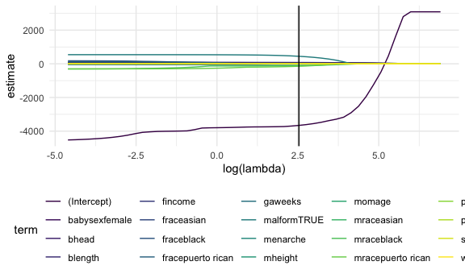

statistical learning
================

``` r
library(tidyverse)
```

    ## ── Attaching packages ─────────────────────────────────────── tidyverse 1.3.1 ──

    ## ✓ ggplot2 3.3.5     ✓ purrr   0.3.4
    ## ✓ tibble  3.1.5     ✓ dplyr   1.0.7
    ## ✓ tidyr   1.1.3     ✓ stringr 1.4.0
    ## ✓ readr   2.0.1     ✓ forcats 0.5.1

    ## ── Conflicts ────────────────────────────────────────── tidyverse_conflicts() ──
    ## x dplyr::filter() masks stats::filter()
    ## x dplyr::lag()    masks stats::lag()

``` r
library(viridis)
```

    ## Loading required package: viridisLite

``` r
library(glmnet)
```

    ## Loading required package: Matrix

    ## 
    ## Attaching package: 'Matrix'

    ## The following objects are masked from 'package:tidyr':
    ## 
    ##     expand, pack, unpack

    ## Loaded glmnet 4.1-3

``` r
library(modelr)
library(mgcv)
```

    ## Loading required package: nlme

    ## 
    ## Attaching package: 'nlme'

    ## The following object is masked from 'package:dplyr':
    ## 
    ##     collapse

    ## This is mgcv 1.8-38. For overview type 'help("mgcv-package")'.

``` r
library(patchwork)

knitr::opts_chunk$set(
  fig.width = 6,
  fig.asp = .6,
  out.width = "90%"
)

theme_set(theme_minimal() + theme(legend.position = "bottom"))

options(
  ggplot2.continuous.colour = "viridis",
  ggplot2.continuous.fill = "viridis"
)

scale_colour_discrete = scale_colour_viridis_d
scale_fill_discrete = scale_fill_viridis_d
```

statistical learning = machine learning = AI

statistical learning is on a spectrum of tools to do data analysis

Learning from data - supervised learning: there’s an outcome that you
care about and what you learn depends on that outcome (regression,
lsaso, etc.) - unsupervised learning: you have data and you want to
learn stuff (find patterns, ID subgroups, etc.), don’t care about 1
specific outcome (clustering, etc.)

Regression - common understanding, interpretable coefficients,
inference/ p-values

Regression –&gt; Lasso - one drawback of regression is lack of
scalability (fewer model building options with lots of covariates) -
Lasso –&gt; useful when you have a lot of coefficients and a few strong
hypotheses “automatically” selects variables - Lasso adds a penalty on
the sum of all coefficients (minimize residual sum or squares (like
normal regression) and a penalty if your regression coefficients are
big) –&gt; working against each other - it’s regression + a penalty, but
the penalty has a big impact

-   if your penalty gets big, you push to 0 (delete coefficients,
    automatic variables selection)

Lasso drawbacks - no inference/ p-values - very different (if any)
interpretation - IF YOU HAVE A HYPTHESIS TO TEST, LASSO ISN’T YOUR
ANSWER

Tuning parameter selection - dial lambda up and down to decide how much
emphasis to put on the penalty piece - use cross validation

CLUSTERING - data-drive subgroups (non-overlapping, every datapoint is
in 1 and only 1 group) - data is 1 subgrou are more similar to each
other than to points in another group - have to define “similarity” -
we’ll do k-means method –&gt;

k-means method - randomly assign every point to a given group -
calculate mean - reassign based on what point is closest to which mean
(centroid) - continue until everything stops

STARTING CODING

## LASSO

Predicting birthweight

``` r
set.seed(11)

bwt_df = 
  read_csv("data/birthweight.csv") %>% 
  janitor::clean_names() %>%
  mutate(
    babysex = as.factor(babysex),
    babysex = fct_recode(babysex, "male" = "1", "female" = "2"),
    frace = as.factor(frace),
    frace = fct_recode(frace, "white" = "1", "black" = "2", "asian" = "3", 
                       "puerto rican" = "4", "other" = "8"),
    malform = as.logical(malform),
    mrace = as.factor(mrace),
    mrace = fct_recode(mrace, "white" = "1", "black" = "2", "asian" = "3", 
                       "puerto rican" = "4")) %>% 
  sample_n(200)
```

    ## Rows: 4342 Columns: 20

    ## ── Column specification ────────────────────────────────────────────────────────
    ## Delimiter: ","
    ## dbl (20): babysex, bhead, blength, bwt, delwt, fincome, frace, gaweeks, malf...

    ## 
    ## ℹ Use `spec()` to retrieve the full column specification for this data.
    ## ℹ Specify the column types or set `show_col_types = FALSE` to quiet this message.

For Lasso, you want a lot of predictors relative to the number of
observations, so this is why we do a sample

It’s December… let’s just do the lasso and move on.

Lasso doesn’t want a df –&gt; it wants a matrix of predictors

``` r
y = bwt_df %>% pull(bwt)
x = model.matrix(bwt ~ ., bwt_df)
```

Let’s fit lasso,

``` r
lambda_grid = 10 ^ seq(3, -2, by = -0.1)

lasso_fit = glmnet(x, y, lambda = lambda_grid)

lasso_cv = cv.glmnet(x, y, lambda = lambda_grid)

lasso_opt = lasso_cv$lambda.min
```

Can we actually see what we did?

``` r
lasso_fit %>% 
  broom::tidy() %>% 
  complete(term, lambda, fill = list(estimate = 0)) %>% 
  ggplot(aes(x = log(lambda), y = estimate, group = term, color = term)) + 
  geom_path() + 
  geom_vline(xintercept = log(lasso_opt))
```



Lasso is trying to very gradually remove things from the model and then
shrunk down the values of the esimates
